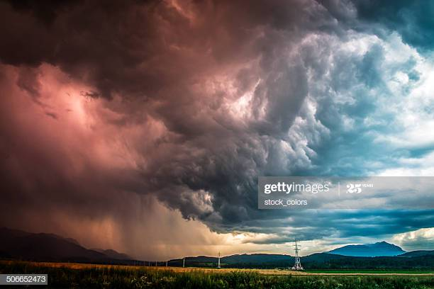

# Ominous-Clouds

A story

Today the sun did not come up. It might have, but **ominous clouds** shrouded the sky. What makes a cloud **ominous**? Some say it's that static in the air, that _inkling_ that any moment a thunderstorm could break out of its bloated confines. Others say it's the towering magnifiscence that dwarfs even [the tallest earthlings](https://en.wikipedia.org/wiki/Giraffe). But to me the **ominousity** was made apparent by the roaring voice coming from the sky. It wailed:

